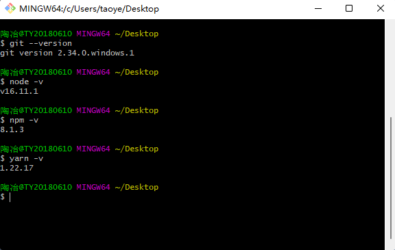
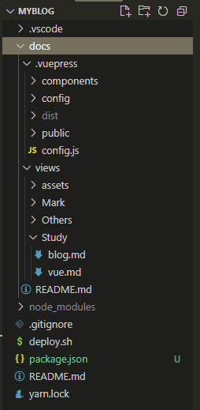
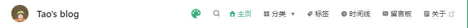

:::tip
本文记录搭建此 Blog 的具体步骤和一些 tips
:::

<!-- more -->

## 一/ 介绍

其实一直都有搭建个人博客的想法，但是没实施，原因很简单：大部分后端的技术栈还没有学习过，前端又有一堆文档等着啃。  
偶然间在 B 站看到有些大佬在评论区贴上自己的 Blog，其中介绍到**VuePress**，在了解其搭建过程后，意识到还是可以搞一搞的，遂搞。

## 二/ VuePress

此博客使用[VuePress](https://vuepress.vuejs.org/zh/guide/) + [vuepress-theme-reco](https://vuepress-reco-doc.now.sh/)主题构建。

**VuePress**由两部分组成：第一部分是一个极简静态网站生成器 (opens new window)，它包含由 Vue 驱动的主题系统和插件 API，另一个部分是为书写技术文档而优化的默认主题，它的诞生初衷是为了支持 Vue 及其子项目的文档需求。事实上，一个 VuePress 网站是一个由 Vue (opens new window)、Vue Router (opens new window)和 webpack (opens new window)驱动的单页应用。

**vuepress-theme-reco**：一位大佬开源的 VuePress 主题，根据默认主题修改而成，且官方的主题配置仍然适用。

## 三/ 步骤

### 1. 准备环境



### 2. 创建目录

  
其中：  
docs：根目录  
.vuepress：此文件夹名称固定，不得更改
components：vue 组件  
config：一些配置项  
config.js：必要配置文件
public：静态文件  
views：展示页面  
README.md：主页  
::: tip
包初始化&安装 VuePress 本地依赖&安装 vuepress-theme-reco  
VuePress 官方推荐使用 Yarn 安装
:::

```sh
yarn init # npm init
yarn add -D vuepress # npm install -D vuepress
yarn add vuepress-theme-reco # npm install vuepress-theme-reco --save-dev
```

### 3. 主页和配置项

README.md 主页，需要注意一个地方：图片的指向是默认在 public 下的。

```md
---
home: true
heroImage: /img/naruto3.png
heroText: This is Tao
tagline: 世上没有白走的路，每一步都算数
bgImage: '/img/bg.png'
bgImageStyle: { height: '100vh', color: '#fff' }
---

<NewFont />
```

在 config.js 中引入 vuepress-theme-reco 主题，并设置为 blog 模式

```js
// .vuepress/config.js
module.exports = {
  theme: 'reco',
  themeConfig: {
    type: 'blog'
  }
}
```

在 package.json 中配置服务器启动

```js
//package.json
{
  "scripts": {
    "docs:dev": "vuepress dev docs",
    "docs:build": "vuepress build docs"
  }
}
```

```sh
yarn docs:dev # npm run docs:dev
```

此时若配置无误，应该可以在 _http://localhost:8080_ 看到主页，这样一个博客的雏形就建立好啦。  
接下来就是一步一步补充完善你需要有的细节，其实接下来的步骤让我联想到以前装扮 QQ 空间的时候，都是往上添加自己喜欢的个性化组件，不过这里是用代码而已。

OK，那么接下来先从**导航栏**开始吧。  


左侧的 logo 和博客名：

```js
// .vuepress/config.js
module.exports = {
  title: "Tao's blog",
  themeConfig: {
    logo: '/img/naruto.jpg' //nav左侧的小logo
  }
}
```

右侧，其中夜间模式切换和搜索栏为主题自带：

```js
// .vuepress/config.js
module.exports = {
  themeConfig: {
    nav: [
      { text: '主页', link: '/', icon: 'reco-home' },
      {
        text: '时间线',
        link: '/timeline/',
        icon: 'reco-date'
      },
      {
        text: '留言板',
        link: '/views/Others/messageBoard.md',
        icon: 'reco-message'
      },
      {
        text: '关于',
        link: 'https://vuepress-theme-reco.recoluan.com/',
        icon: 'reco-blog'
      }
    ],
    blogConfig: {
      category: {
        location: 2, // 在导航栏菜单中所占的位置，默认2
        text: '分类' // 默认文案 “分类”
      },
      tag: {
        location: 3, // 在导航栏菜单中所占的位置，默认3
        text: '标签' // 默认文案 “标签”
      }
    }
  }
}
```

导航栏中的分类、标签以及时间线，需要在文章页面中进行设置：

```md
---
title: VuePress搭建个人Blog
date: 2021-11-27 12:40
categories:
  - blog搭建
  - 历程
tags:
  - Blog
  - VuePress
sticky: 1
---
```

留言板和文章评论功能会放在另一篇[文章](./valine&vssue.md)中说明。  
主页的具体配置项在 reco 的 [官方文档](https://vuepress-theme-reco.recoluan.com/views/1.x/home.html)中有详细说明。

下面是一些个人觉得比较有用的 Plugins：  
其中的音乐播放器插件可以直接拉取网易云音乐的歌单，属实不错，mid可以通过分享歌单的链接得到。
```js
module.exports = {
  plugins: {
    // 阅读进度条: "vuepress-plugin-reading-progress"
    'reading-progress': true,
    //一键复制代码插件: "vuepress-plugin-code-copy"
    'vuepress-plugin-code-copy': true,
    // vuepress-plugin-dynamic-title
    'dynamic-title': {
      showIcon: '/favicon.ico',
      showText: '',
      hideIcon: '/failure.ico',
      hideText: '嘿！咋走啦',
      recoverTime: 2000
    },
    //vuepress-plugin-meting: 音乐播放器
    meting: {
      meting: {
        // 网易
        server: 'netease',
        // 读取歌单列表
        type: 'playlist',
        mid: 'yourmid'
      },
      // 不配置该项的话不会出现全局播放器
      aplayer: {
        fixed: true,
        mini: true,
        autoplay: true,
        listFolded: true,
        theme: '#f9bcdd',
        order: 'random',
        volume: 0.3,
        lrcType: 0
      },
      mobile: {
        // 手机端去掉cover图
        cover: false
      }
    }
  }
}
```

其实到这里一个博客的功能就基本具备了，如果深挖还是有很多可以去玩的地方的。  
当然，建立博客的目的可不能忘了，一定要输入内容才有它存在的意义。
### 4. 上传 Github 并部署
这里有一些要注意的点和踩过的坑，记录在[这里](./aboutGithub.md)。
